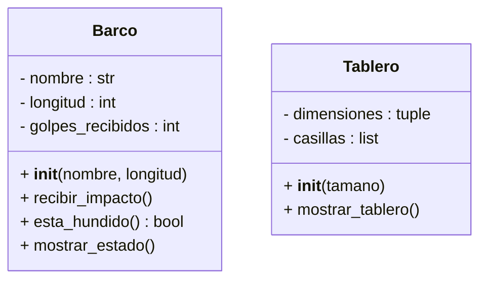

```mermaid
classDiagram
    class Barco {
        - nombre : str
        - longitud : int
        - golpes_recibidos : int
        + __init__(nombre, longitud)
        + recibir_impacto()
        + esta_hundido() bool
        + mostrar_estado()
    }

    class Tablero {
        - dimensiones : tuple
        - casillas : list
        + __init__(tamano)
        + mostrar_tablero()
    }
```